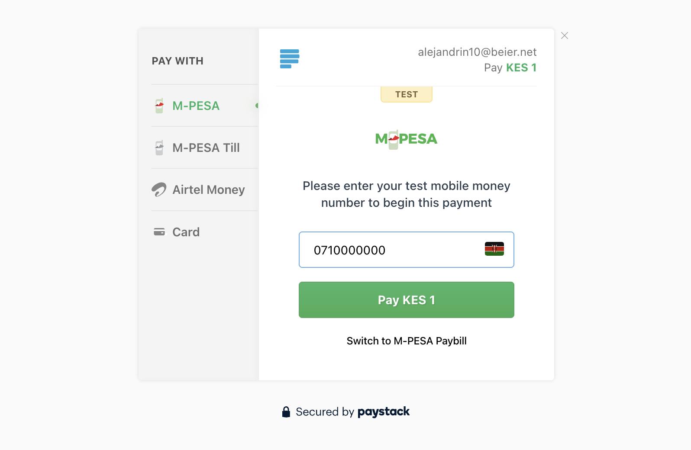

# Initialize Transaction

For customers to pay for a product or a service on you application, they need a payment page. Paystack allows you to generate such page (called authorization url) thought the api.  An authorization url allows customers to securely enter their payment details and complete a transaction.

## Making a Request

To generate the URL in you Laravel code, create an instance of `InitializeRequestData` and pass to `Transaction::initialize`, 

```php
use NjoguAmos\Paystack\Facades\Transaction;
use NjoguAmos\Paystack\Data\Transactions\InitializeRequestData;

$data = new InitializeRequestData(
    amount: 10000,
    email: 'customer@example.com'
);

$response = Transaction::initialize(data: $data);

$authorizationUrl = $response->authorization_url;
# e.g. https://checkout.paystack.com/3ni8kdavz62431k
```

## Handling the Response

After payment completion, Paystack will redirect to your callback URL or the default URL set in your dashboard.

```php
// Redirect the user to the payment page or render on an iframe
return redirect()->away($response->authorization_url);

// Or if you're using an API
return response()->json([
    'authorization_url' => $response->authorization_url,
    'access_code' => $response->access_code,
    'reference' => $response->reference,
]);
```

The `authorization_url` should render a payment page similar to this:



## Request Parameters

The request parameter must be an instance of `\NjoguAmos\Paystack\Data\Transactions\InitializeRequestData` and accepts the following parameters.

| Parameter          | Type     | Required | Description                                                                                                   |
|--------------------|----------|----------|---------------------------------------------------------------------------------------------------------------|
| amount             | int      | Yes      | Amount in the smallest currency unit                                                                          |
| email              | string   | Yes      | Customer's email address                                                                                      |
| reference          | int      | Yes      | Unique transaction reference. e.g Your transactions table primary key.                                        |
| currency           | Currency | No       | Transaction currency (defaults to your integration currency). Instance of `NjoguAmos\Paystack\Enums\Currency` |
| callback_url       | string   | No       | URL to redirect to after payment. Overrides the callback URL set in your dashboard.                           |
| plan               | string   | No       | If transaction is for a subscription, provide the plan code here (invalidates the amount parameter)           |
| invoice_limit      | int      | No       | Number of times to charge customer during subscription to plan                                                |
| metadata           | string   | No       | Stringified JSON object of custom data                                                                        |
| channels           | array    | No       | Payment channels to make available. An array of `NjoguAmos\Paystack\Enums\Currency`                           |
| split_code         | string   | No       | The split code for transaction split (e.g., `SPL_98WF13Eb3w`)                                                 |
| subaccount         | string   | No       | The code for the subaccount that owns the payment (e.g., `ACCT_8f4s1eq7ml6rlzj`)                              |
| transaction_charge | int      | No       | Amount to override the split configuration for a single split payment                                         |
| bearer             | Bearer   | No       | Who bears the transaction charges. An instance of `\NjoguAmos\Paystack\Enums\Bearer`                          |

> [!IMPORTANT]
> The `reference` parameter can be used to [verify](/transactions/verify-transaction) a transaction later.

## Response Parameters

The a successful response is an instance of `\NjoguAmos\Paystack\Data\Transactions\InitializeResponseData` and contains the following properties:

| Property          | Type   | Description                                 |
|-------------------|--------|---------------------------------------------|
| authorization_url | string | URL to redirect the customer to for payment |
| access_code       | string | Access code for the transaction             |
| reference         | string | Transaction reference                       |

## Advanced Example

You can pass more supported field as defined in `InitializeRequestData` in the request.

```php
use \NjoguAmos\Paystack\Enums\Bearer;
use NjoguAmos\Paystack\Enums\Currency;
use \NjoguAmos\Paystack\Enums\Channel;
use NjoguAmos\Paystack\Endpoints\Transaction
use NjoguAmos\Paystack\Data\Transactions\InitializeRequestData;

// Create request data with additional parameters
$data = new InitializeRequestData(
    amount: 50000,
    email: 'customer@example.com',
    reference: 5764789325239,
    currency: Currency::KES,
    callback_url: 'https://example.com/callback',
    channels: [Channel::MOBILE_MONEY, Channel::BANK],
    subaccount: 'acc_122',
    bearer: Bearer::SUB_ACCOUNT 
);

$transaction = Transaction::initialize(data: $data);
```
